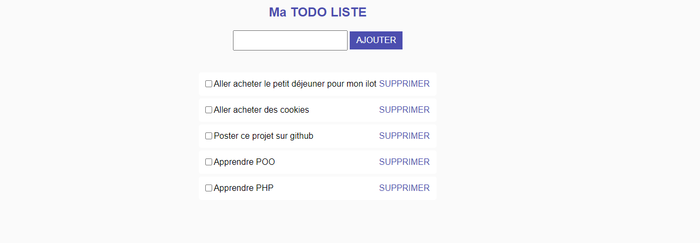

# :page_with_curl: To-Do List App #

## Description ##

Cette petite application en php permet à l'utilisateur de gérer une liste de tâches qu'il souhaite effectuer. L'utilisateur peut ajouter autant de tâches qu'il souhaite, cocher les tâches comme complétées ou bien encore supprimer celle(s) accomplie(s).

### Fonctionnalités ###

- Ajout : L'utilisateur peut saisir une tâche qu'il souhaite accomplir et l'ajouter à la liste en appuyant sur le bouton "AJOUTER".
- Marquage : L'utilisateur peut cliquer sur une case à cocher à côté de chaque tâche. La tâce est considéré comme complété et la ligne sera donc barré.
- Suppression : L'utilisateur peut supprimer s'il le souahte une tâche barré ou non, en cliquant sur le bouton "SUPPRIMER" à côté de la tâche adéquate.

#### Structure du Projet ####

Le projet est organisé comme suit :

- `index.php` : Fichier principal de l'application.
- `todolist.sql` : Base de donnée.
- `css/styles.css` : Fichier CSS pour le style de l'application.
- `img` : Favicon + Capture d'écran

###### Technologies Utilisées ######


## Installation

1. Clonez le dépôt :

```bash
git clone https://github.com/chr1stopherperez/ToDo_List_PHP.git
cd ToDo_List_PHP

```

## Captures d'écran

<p align="center">
  
  
</p>